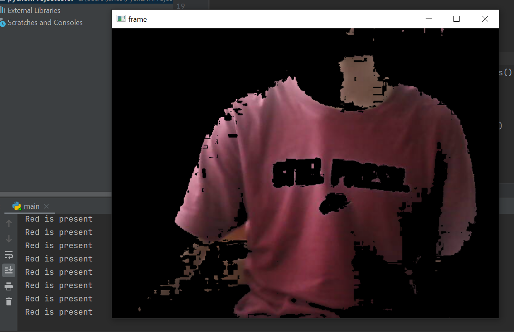

### Colour detection with openCV
Tools used: openCV (python)
- This is another openCV project which I'm testing out to detect colours (converting BGR to HSV), which in this case is red colour. 
- The idea behind this is to create lower and upper boundaries for the red colour for the "mask" which will match with the image

